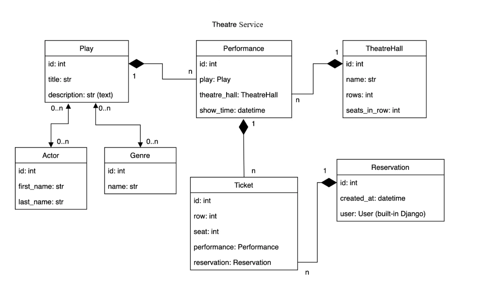
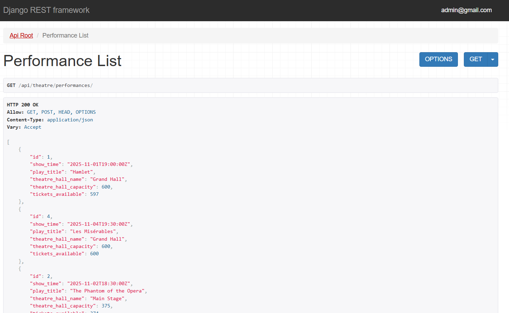
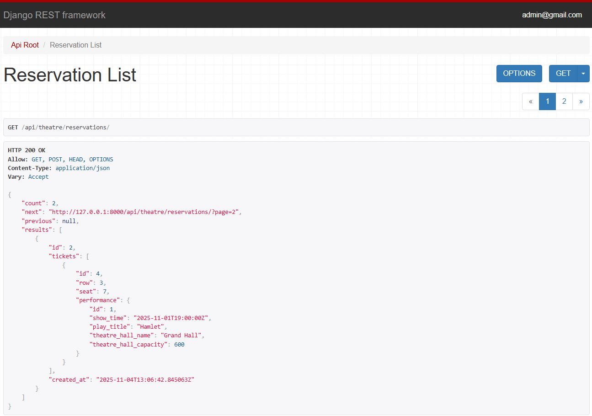
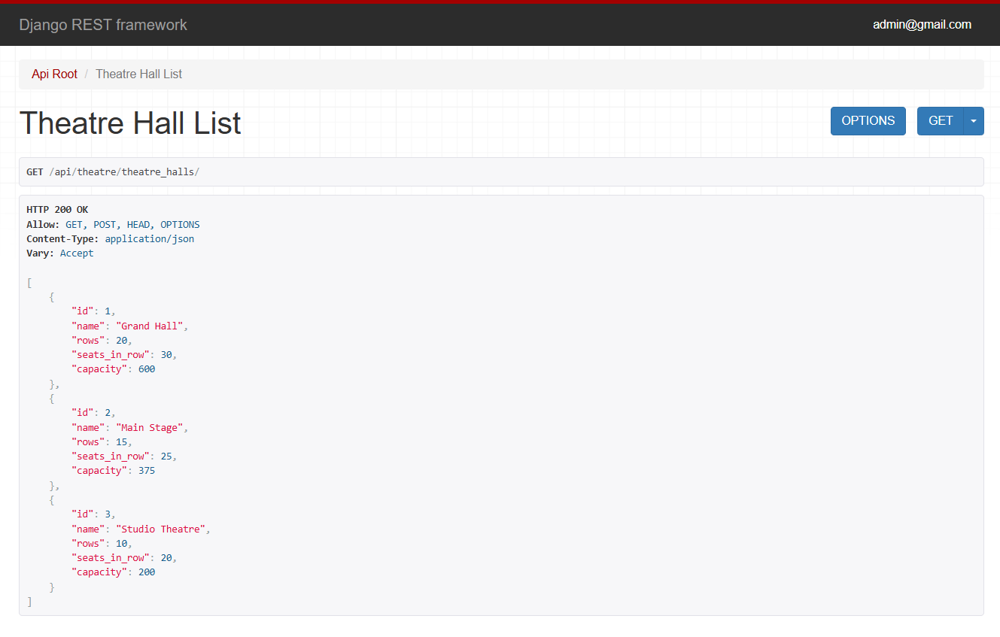
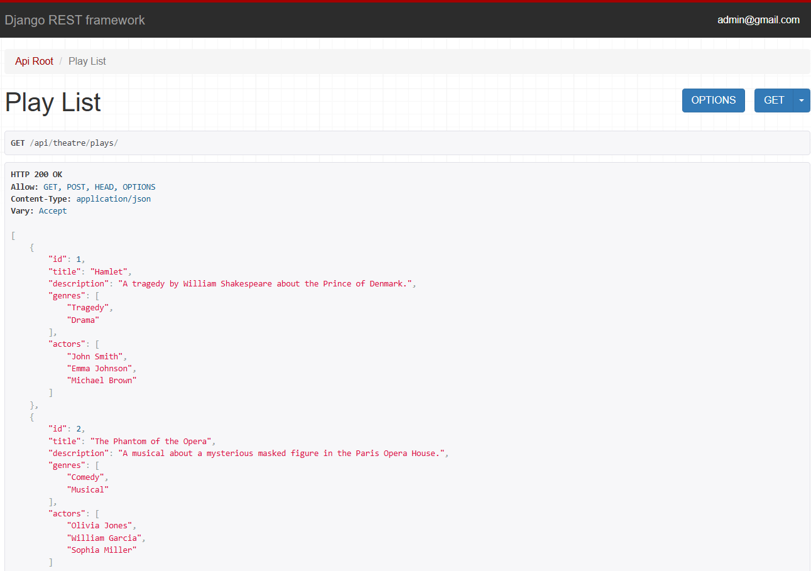
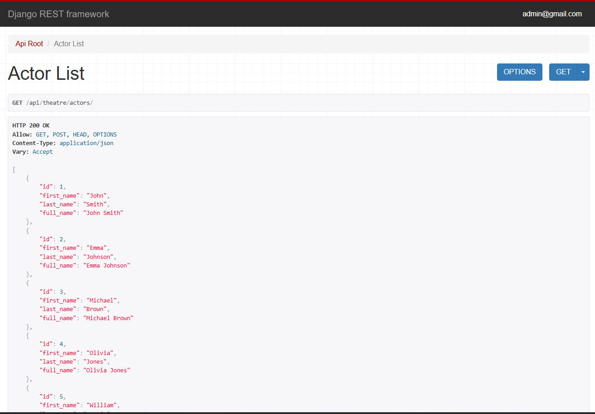
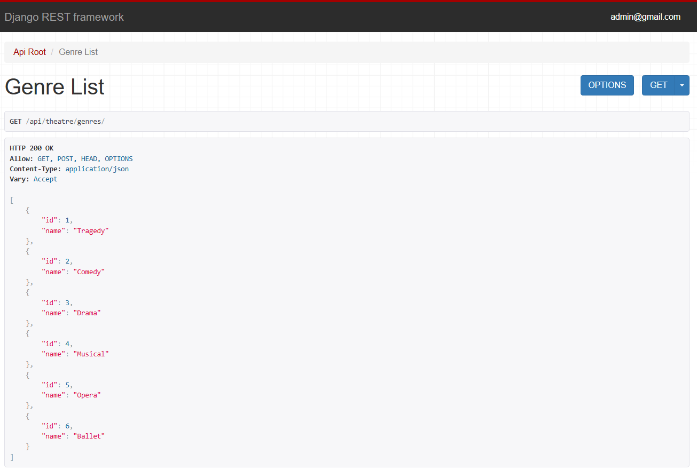

# 🎭 Theatre Laboratory API

## 📖 Overview
**Theatre Laboratory** is a RESTful API built with **Django** and **Django REST Framework** for managing theatrical performances, halls, tickets, and users.  
The project allows users to browse performances, manage bookings, and handle authentication.  
It was created as a **Portfolio Project** based on the Theatre Service structure, with custom business logic and PostgreSQL integration.

---

## ⚙️ Features
- 🔑 JWT authentication (register, login, logout)
- 🎭 Manage performances, genres, and halls
- 🎫 Book and view tickets
- 👤 User roles (admin / regular user)
- 🗃 PostgreSQL database integration
- 🧩 Dockerized setup for easy deployment
- 🧾 Browsable API with Django REST Framework UI

---

## 🧰 Tech Stack
- **Backend:** Django 5+, Django REST Framework  
- **Database:** PostgreSQL
- **Containerization:** Docker & Docker Compose  
- **Authentication:** JWT (`djangorestframework-simplejwt`)
---
## Database Structure
Below is the ER diagram of the project:

---
## 📸 API Screenshots

Below are screenshots from the **Browsable API** demonstrating the main endpoints of the project.

---

### 🎭 Performances Endpoint
`/api/theatre/performances/`
> Get list of performances, available filters and details

---

### 🎫 Reservations Endpoint
`/api/theatre/reservations/`
> Create and view reservations for performances

---

### 🏛 Theatre Halls Endpoint
`/api/theatre/halls/`
> Manage halls and view their capacity

---

### 🎭 Plays Endpoint  
`/api/theatre/plays/`  
> Manage plays, view details such as title, description, genre, and actors.  

---

### 👤 Actors Endpoint  
`/api/theatre/actors/`  
> Manage actors and view their personal details, including roles in plays.  

---

### 🏷 Genres Endpoint  
`/api/theatre/genres/`  
> Browse and manage genres available in the theatre system.  

---
